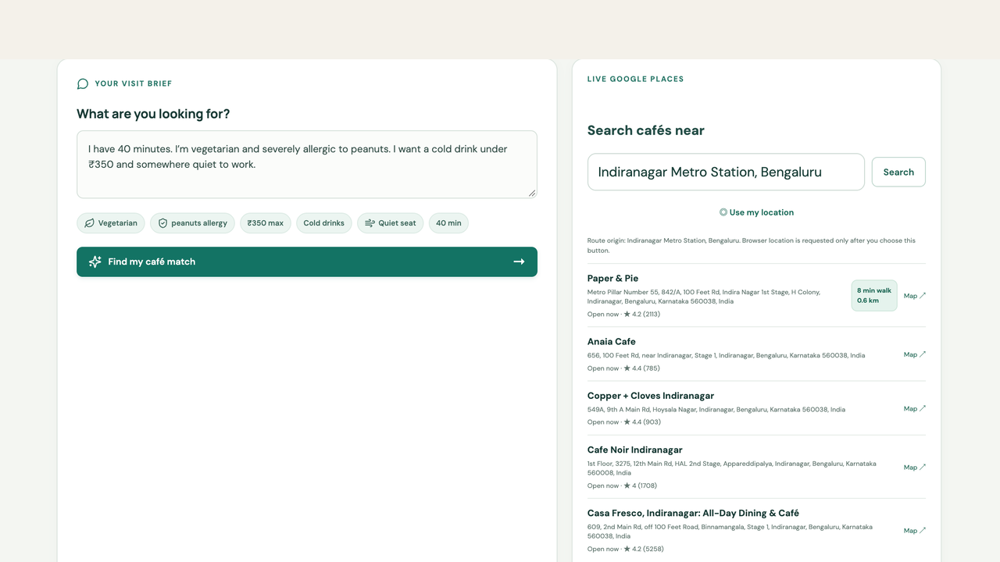
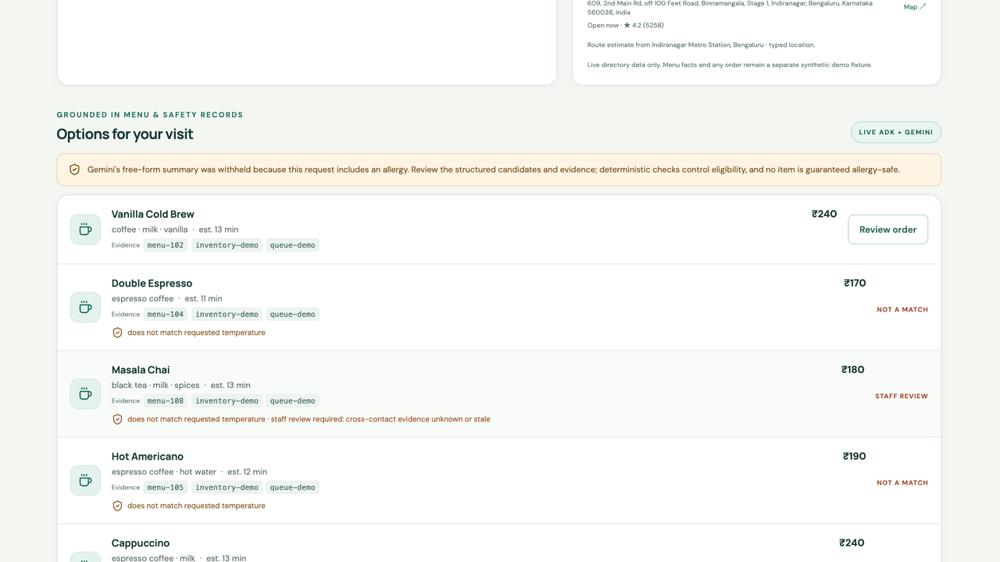
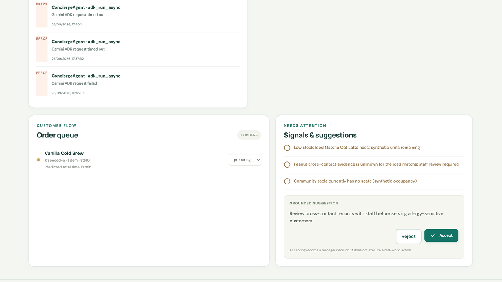
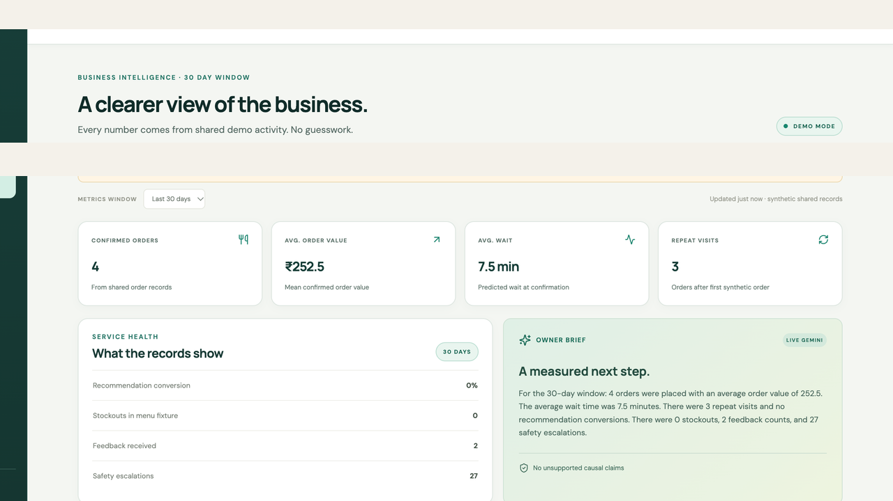
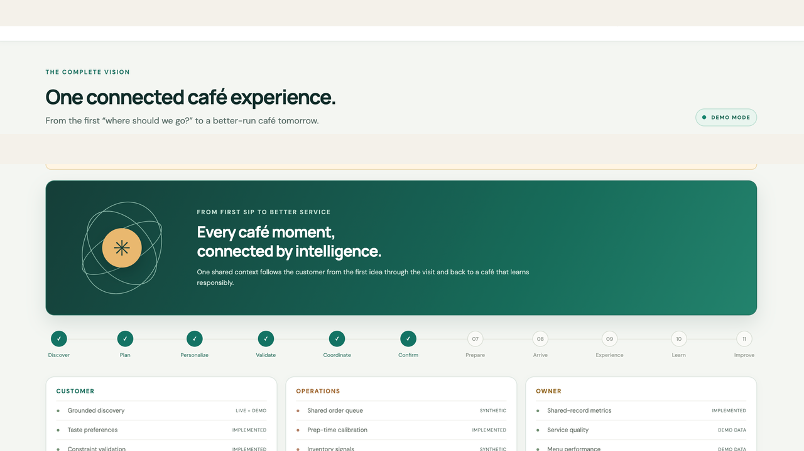
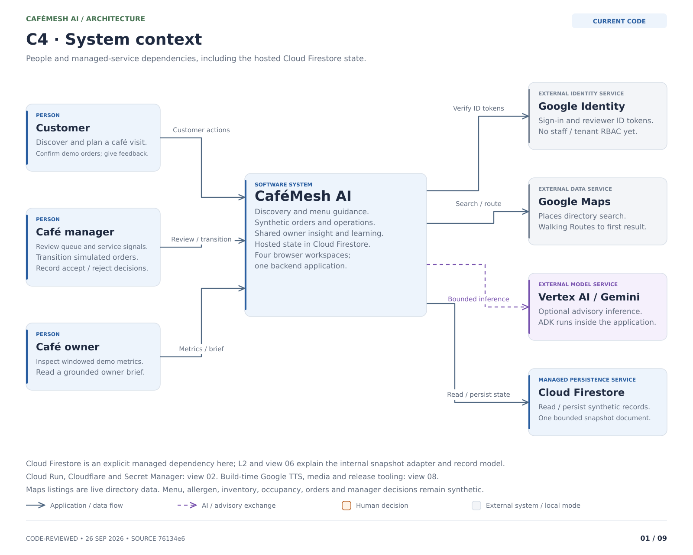

# CaféMesh AI

**Your café experience, intelligently connected.**

CaféMesh AI connects café discovery, menu guidance, simulated ordering, café operations, and owner insights in one shared workflow. Built with Google ADK/Gemini, FastAPI, React, and Google Cloud, it is a **working synthetic-data demo** with a documented path toward a complete café product.

[](https://github.com/imrohitagrawal/cafemesh-ai/actions/workflows/quality.yml)

**[Try the live demo](https://cafemesh.stackclimb.com)** · **[Watch the product walkthrough](https://cafemesh.stackclimb.com/videos/cafemesh-product-walkthrough.mp4)** · **[Explore the architecture](docs/architecture/README.md)** · **[See the complete product plan](docs/14-END-TO-END-CAPABILITIES.md)**

[](https://cafemesh.stackclimb.com/videos/cafemesh-product-walkthrough.mp4)

*Customer discovery captured on 26 September 2026. Click the image for the narrated product walkthrough.*

> **Demo boundary:** café menu, allergen, inventory, orders, occupancy, and manager records are synthetic. Places/Routes directory data is separate from that catalog. No real order, payment, POS update, seating reservation, or staff dispatch occurs. Known implementation gaps are tracked in the [code-first audit](docs/architecture/ARCHITECTURE-AUDIT.md).

[Demo and videos](#demo-and-videos) · [Screenshots](#screenshots) · [Capabilities](#current-capabilities) · [Architecture](#architecture-and-stack) · [Run locally](#run-locally) · [Verification](#verification) · [Documentation](#documentation) · [Contributing](#contributing-and-support)

## Why CaféMesh

A customer's constraints, an order's progress, and an owner's metrics should refer to the same visit. CaféMesh demonstrates that connection: structured menu evidence informs a proposed order, the simulated order appears in Operations, and shared records feed Owner metrics and visible preference feedback. Model-generated explanations are advisory; backend code owns action checks.

The intended product serves customers, café teams, owners, and administrators. The current app has four workspaces: **Customer, Operations, Owner, and Vision**. Community features and full café administration remain planned.

## Demo and videos

| Start here | What you will see | Length | Alternative |
| --- | --- | --- | --- |
| [Live application](https://cafemesh.stackclimb.com) | Public Customer demo and Vision; protected reviewer views when sign-in is configured | Interactive | [Run locally](#run-locally) |
| [Product walkthrough](https://cafemesh.stackclimb.com/videos/cafemesh-product-walkthrough.mp4) | Customer discovery, recommendations, Operations, Owner and the product vision | 6:55 | [Repository MP4](frontend/public/videos/cafemesh-product-walkthrough.mp4) |
| [Engineering walkthrough](https://cafemesh.stackclimb.com/videos/cafemesh-engineering-walkthrough.mp4) | Architecture, agents, policy controls, evaluation, delivery and roadmap | 9:41 | [Repository MP4](frontend/public/videos/cafemesh-engineering-walkthrough.mp4) |
| [Two-minute overview](media/cafemesh-two-minute-demo.mp4) | A concise narrated slide overview | 2:00 | [Media guide](media/README.md) |

The longer videos use authentic, sanitized, point-in-time screenshots with paragraph-matched narration. They are not continuous recordings or proof of current provider health. The short overview uses slides. [Scripts, audio, timing, provenance and regeneration notes](media/README.md) are available alongside the media. Current written architecture and the audit take precedence over earlier narration where they differ.

### Try the connected journey

1. Open **Customer** and describe your visit, drink, budget and constraints. Inspect the extracted constraints, evidence and synthetic labels.
2. Review available choices. If an item requires staff review, treat that as a blocked demo path; choose an eligible option to preview and explicitly confirm a simulated order.
3. In **Operations**, inspect the shared order, allowed transitions, activity and manager decision record. Accept/reject records a decision; it does not execute a real intervention.
4. In **Owner**, inspect the reporting window and shared-record metrics. Return to Customer and submit feedback to observe bounded preference changes.
5. Open **Vision** for the intended complete product and its planned capabilities.

Hosted Operations/Owner access uses Google sign-in; deployment notes describe an OAuth Testing audience, so your account may not have access. No credentials are included in this repository. Use the videos or the local demo for review. Google token verification is implemented; application staff/owner roles and tenant isolation remain planned.

## Screenshots

These sanitized captures are from **26 September 2026**, not fresh health checks. Recorded errors and historical values remain visible. Click an image to inspect it at full size; see the [capture provenance](media/provided-app-screenshots/README.md).

| Customer recommendations | Operations |
| --- | --- |
| [](media/provided-app-screenshots/product/scene-03.png) | [](media/provided-app-screenshots/product/scene-05.png) |
| Structured choices and visible review status. | Shared order state, signals and decision controls. |

| Owner | Vision |
| --- | --- |
| [](media/provided-app-screenshots/product/scene-07.png) | [](media/provided-app-screenshots/product/scene-00.png) |
| Metrics from shared synthetic records; known formula limits are audited. | Product direction; this screen includes planned capabilities. |

## Current capabilities

| Area | Implemented today | Boundary |
| --- | --- | --- |
| Discovery | Google Places search and walking Routes using typed origin or opt-in coordinates | Directory listing does not mean café participation |
| Customer guidance | Lexical menu matching, request-supplied constraints, evidence IDs, optional ADK/Gemini explanation | Small synthetic catalog; no document RAG; safety checks have recorded gaps |
| Order journey | Stored preview, explicit simulated confirmation, duplicate-key replay and allowlisted transitions | No real fulfillment, stock reservation or payment; expiry/retry gaps remain |
| Operations | Shared orders, fixture alerts, activity, timings, errors and accept/reject records | Application read model, not production monitoring or executed interventions |
| Owner | Windowed demo metrics and optional tool-backed brief | KPI populations and narrative verification remain limited |
| Learning | Four bounded preference weights and measured timing samples | Safety is not learned; constraint continuity and timing semantics need fixes |
| Identity and state | Reviewer Google tokens; SQLite locally or a bounded Firestore snapshot | No tenant/staff RBAC; Firestore is one serialized SQLite snapshot |
| Media | Saved Google TTS narration and MP4 walkthroughs | Build-time generation and runtime playback; no live voice conversation |

**Planned:** governed café administration, transactional inventory, reservations/waitlists, arrival coordination, service recovery, Connect events/groups, POS/payments/loyalty, privacy lifecycle, multi-location analytics, governed document RAG, and evaluated live voice. See the [26-area capability matrix and delivery gates](docs/14-END-TO-END-CAPABILITIES.md).

The [15-finding developer handoff](docs/architecture/DEVELOPER-HANDOFF.md) gives code locations, reproduction cases and suggested closure evidence. Existing passing tests do not establish that those gaps are fixed.

## Architecture and stack

[](docs/04-ARCHITECTURE.md)

| Layer | Implementation |
| --- | --- |
| Browser | React 18, TypeScript, Vite, Lucide icons |
| API and policy | Python, FastAPI, Pydantic, Uvicorn; deterministic domain checks |
| Agents | Google ADK and Gemini via Vertex AI or configured API-key mode; three custom read tools |
| Business facts and state | Code fixtures; eight SQLite tables; optional single-document Firestore snapshot adapter |
| Discovery and identity | Google Places/Routes and Google Identity ID-token verification |
| Hosting and delivery | Cloud Run, Docker, Cloudflare Worker; GitHub Actions verification |
| Media production | Google Cloud Gemini-TTS, screenshot preparation and FFmpeg |

The [nine-view architecture atlas](docs/architecture/README.md) includes context, containers, runtime modules, action flow, data/learning, agent execution, delivery, the production reference, and the end-to-end product map. Each has SVG, PNG, editable Excalidraw and Mermaid sources. Current implementation, deployment-documentation evidence, and planned architecture are explicitly distinguished. Detailed component/workflow views are included; a full formal LLD package is not yet complete.

## Run locally

Use Python 3.11+ (CI/runtime verification uses 3.12), Node.js 22 as used in CI, npm, Git, Make and [`uv`](https://docs.astral.sh/uv/).

```sh
git clone https://github.com/imrohitagrawal/cafemesh-ai.git
cd cafemesh-ai
uv sync --locked
npm ci --prefix frontend
make dev
```

Open <http://localhost:5173>. The API runs at <http://localhost:8000>; interactive API documentation is at <http://localhost:8000/docs>. No Google credential is needed for the default deterministic local demo. `make setup` remains a convenience alternative; the commands above install the committed lockfiles.

For a single-port build:

```sh
make build
make serve
```

Open <http://localhost:8000>. Local state is stored in `data/cafemesh.db`. The reset control restores synthetic seed records; it is not a customer data-deletion workflow.

### Optional providers

Copy [`.env.example`](.env.example) to `.env` and configure only the providers you need. Use ADC/runtime identity for Vertex AI; keep Maps/API credentials server-side and out of `VITE_*` variables. Set `GOOGLE_CLIENT_ID` and `CAFEMESH_REQUIRE_GOOGLE_AUTH=true` when protecting reviewer routes. Full API, IAM, OAuth and deployment details are in [Cloud Run setup](docs/CLOUD-RUN.md).

Configured model failures remain errors rather than successful demo fallback. `/api/status` combines configuration and last observations; it is not a fresh health check of every provider. Troubleshooting and known gaps are documented in the [architecture audit](docs/architecture/ARCHITECTURE-AUDIT.md).

## Verification

```sh
make verify       # Backend tests, TypeScript check, Vite production build
make demo-smoke   # Two connected synthetic journey rehearsals
```

The existing suite has 29 backend tests and three loaded retrieval goldens. `evals/policy-cases.json` is a planning inventory, not an executed parameterized suite. CI also audits Python/JavaScript dependencies, builds Docker, and scans full Git history for secrets. See [current workflow results](https://github.com/imrohitagrawal/cafemesh-ai/actions/workflows/quality.yml), [architecture publication validation](docs/architecture/README.md#publication-validation) and [historical release evidence](docs/11-VERIFICATION-REPORT.md). CI success is not proof of production safety or live-provider availability.

## Documentation

| Reader / task | Start here |
| --- | --- |
| Product reviewer | [Vision](docs/01-PRODUCT-VISION.md), [scope](docs/02-HACKATHON-SCOPE.md), [complete capability coverage](docs/14-END-TO-END-CAPABILITIES.md) |
| Engineer | [Architecture](docs/04-ARCHITECTURE.md), [diagram atlas](docs/architecture/README.md), [agent contracts](docs/05-AGENT-CONTRACTS.md) |
| Developer fixing gaps | [Audit](docs/architecture/ARCHITECTURE-AUDIT.md), [handoff](docs/architecture/DEVELOPER-HANDOFF.md), [safety/evaluation](docs/06-SAFETY-AND-EVALUATION.md) |
| Operator | [Deployment](docs/CLOUD-RUN.md), [verification evidence](docs/11-VERIFICATION-REPORT.md), [engineering practices](docs/13-ENGINEERING-PRACTICES.md) |
| Contributor / presenter | [Contribution guide](CONTRIBUTING.md), [media guide](media/README.md), [demo story](docs/08-DEMO-STORY.md) |
| Planning next milestones | [Roadmap](docs/roadmap/README.md), [learning loops](docs/07-LEARNING-LOOP.md), [retrieval/RAG decision](docs/12-RETRIEVAL-AND-RAG.md) |

See the [documentation index](docs/README.md) for every document and the [repository presentation guide](docs/REPOSITORY-PRESENTATION.md) for About/topics/media maintenance.

## Repository map

```text
backend/cafemesh/    API, domain policy, agents, persistence, observability
frontend/           React UI, public audio/video assets and build configuration
tests/              Backend API, policy and snapshot adapter tests
evals/              Retrieval goldens and policy-case inventory
docs/               Product, architecture, contracts, evidence and roadmap
docs/architecture/  Nine diagram sets, generator, audit and developer handoff
scripts/            Demo rehearsal, narration, screenshots and video generation
media/              Narration, timing, sanitized captures and short overview
deployment/         Cloudflare custom-host routing
```

## Contributing and support

Use [Issues](https://github.com/imrohitagrawal/cafemesh-ai/issues) for reproducible bugs or scoped feature proposals; include the commit, affected workflow, expected result and evidence. Read [CONTRIBUTING.md](CONTRIBUTING.md) before opening a pull request. Report vulnerabilities through the channels described in [SECURITY.md](SECURITY.md), not a public issue. Do not attach credentials, personal customer records or unredacted account screenshots.

The application identifies its creator through [NOTICE](NOTICE). It is maintained by [Rohit Agrawal](https://github.com/imrohitagrawal) under the StackClimb project portfolio.

## License

[CaféMesh AI Source Code License (MIT + Attribution)](LICENSE) is a **custom MIT-derived license**, not the standard MIT SPDX license. Preserve the license and visible end-user attribution required by [NOTICE](NOTICE). Read the full terms before reuse; this presentation update does not change them.
