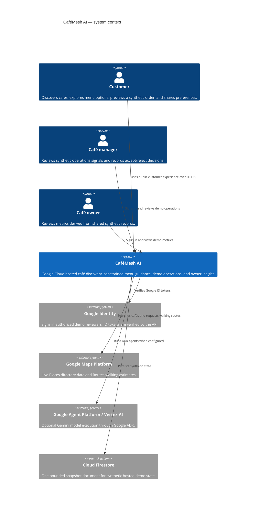
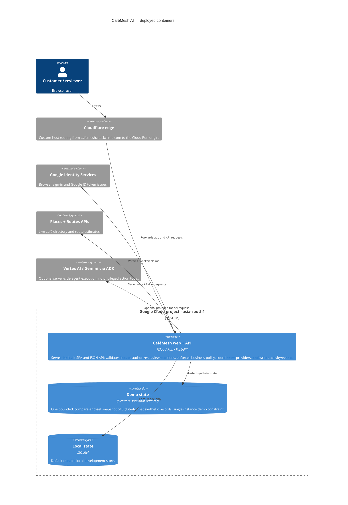
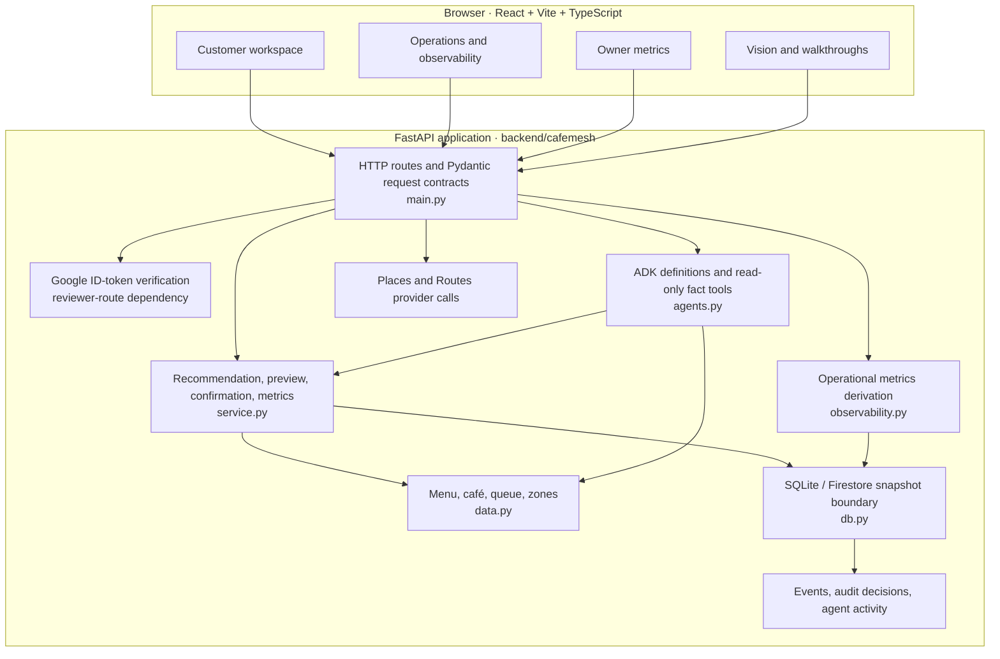
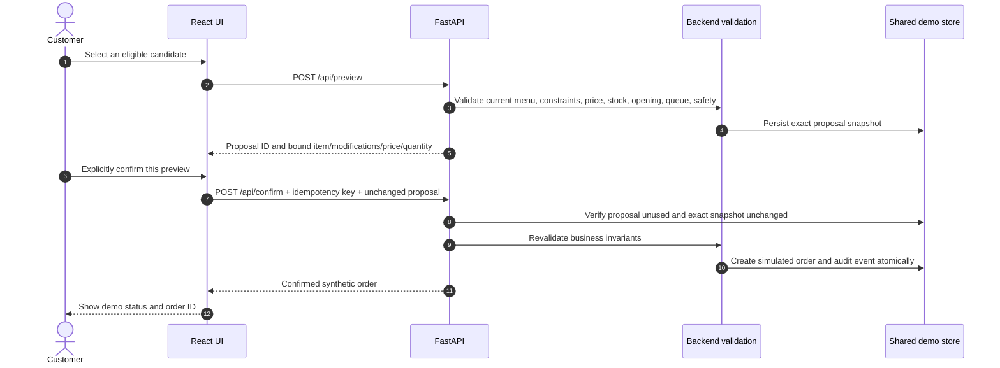
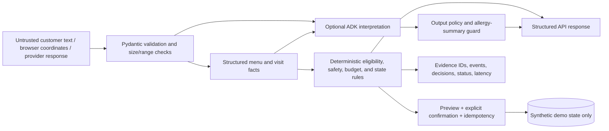
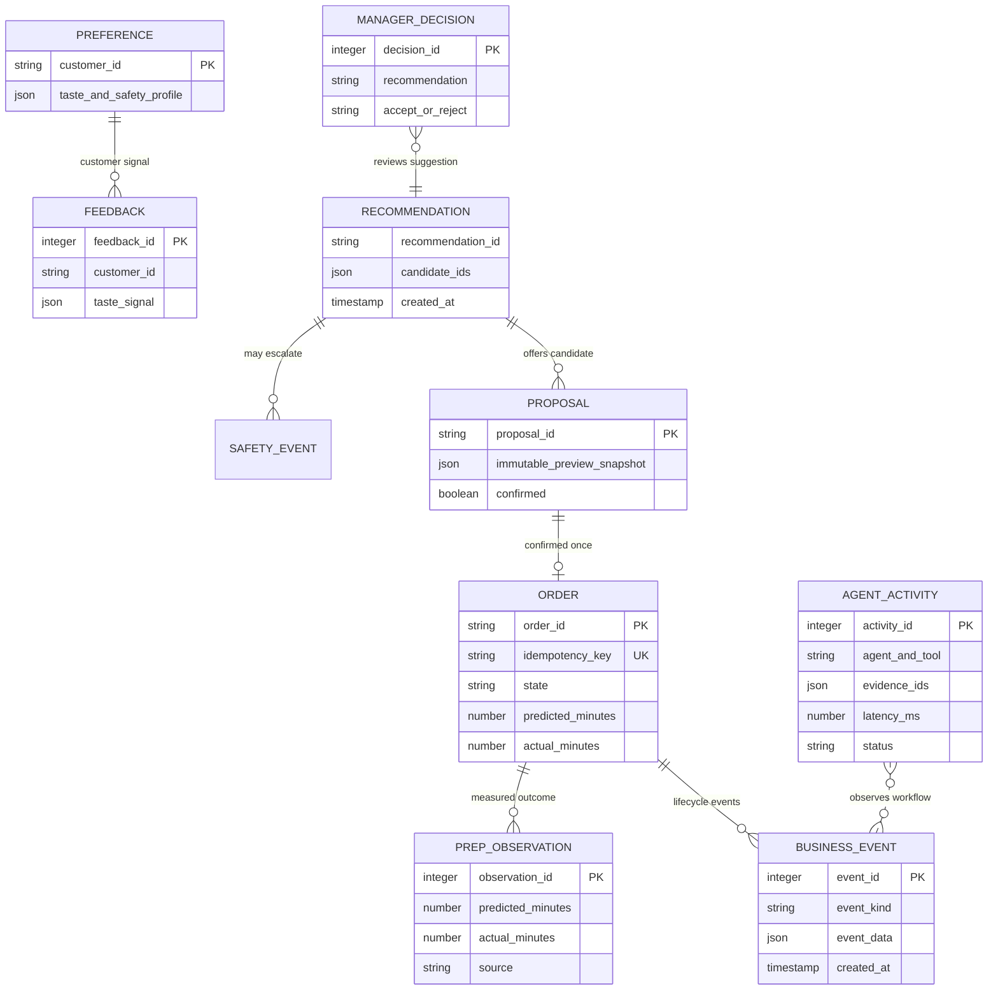
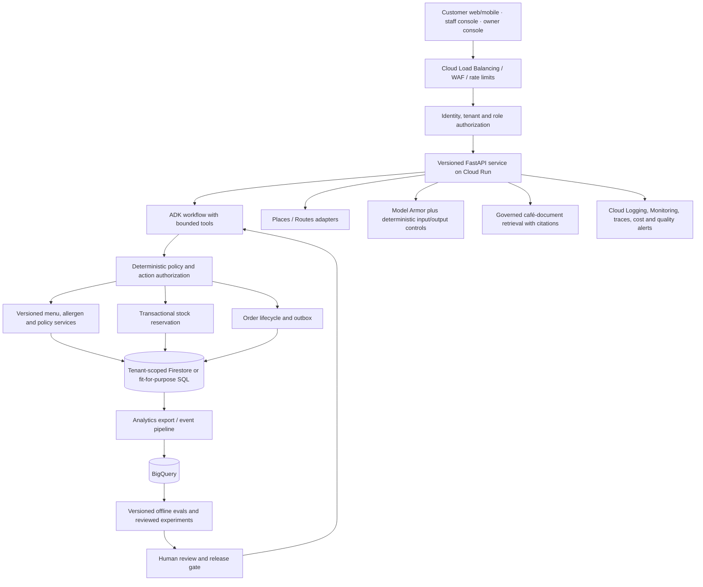

# Architecture

This document shows the running hackathon topology and the intended production direction separately. The current application is a single-service, synthetic-data demo; the target diagrams are not claims that the future services already exist.

## System context (C4 L1)



## Hackathon containers (C4 L2)



The Cloud Run service is publicly reachable so anyone can try the customer demo. Reviewer routes require Google sign-in. Cafe/menu/order/occupancy/manager records are synthetic; a live Maps listing does not mean the café participates in ordering. The OAuth consent audience remains in Testing, so protected views are limited to configured testers.

## Runtime components (C4 L3)



This reflects the current code boundaries, including the intentionally compact `main.py`; it is not a claim of independently deployable microservices. Provider status is represented explicitly. A configured provider error is returned as an error rather than silently converted to a successful demo response.

## Recommendation and safety sequence

```mermaid
sequenceDiagram
  autonumber
  actor Guest as Customer
  participant UI as React UI
  participant API as FastAPI
  participant Rules as Structured retrieval + policy
  participant ADK as ADK agents (optional)
  participant Store as SQLite / Firestore demo state
  Guest->>UI: Request, budget, diet, allergies, time
  UI->>API: POST /api/recommend (validated schema)
  API->>Rules: Match known menu records and apply hard constraints
  Rules->>Store: Record recommendation, evidence, and safety events
  opt Gemini is configured and candidates exist
    API->>ADK: Provide bounded request and authoritative facts
    ADK-->>API: Text and read-tool outcomes
  end
  API->>API: Withhold free-form allergy narrative; retain structured result
  API-->>UI: Candidates, evidence IDs, eligibility, provenance, status
  UI-->>Guest: Explain candidate or staff-review/no-match outcome
```

The ADK layer can interpret and explain but has no order-write tool. Deterministic policy is authoritative. Unknown or stale allergy evidence requires staff review; no menu item is represented as guaranteed allergy-safe.

## Order confirmation sequence



No external café POS, payment, or fulfillment write occurs. A manager accept/reject decision is similarly recorded as a decision; it does not execute staffing or inventory changes.

## Data and trust boundaries



User text, retrieved text, tool output, model text, and provider responses are untrusted. They cannot grant authority. React escapes rendered text; backend schemas and code enforce safety, role checks, and state transitions. Secrets stay server-side and are supplied by deployment configuration/Secret Manager, never in browser bundles.

## Persisted-record relationships (logical, not database foreign keys)



The diagram describes the current logical links through IDs and event payloads, not normalized relational constraints. `db.py` stores demo events, preferences, proposals, orders, feedback, decisions, prep observations, and activity. The hosted adapter serializes these records into a single Firestore snapshot; this must be redesigned for a real tenant or concurrent workload.

## Target production architecture (separate from current implementation)



Production requires an architectural review before adoption: tenant isolation, transactional inventory, access controls, privacy lifecycle, service objectives, backup/restore, rate limits, alert response, and documented data ownership. The snapshot adapter must be replaced; the diagram is a direction, not a deployed system.

## Current integrations and explicit gaps

| Area | Current evidence | Boundary / next engineering step |
| --- | --- | --- |
| ADK + Gemini | Four ADK agent definitions; a live deployed tool interaction was recorded previously. | Model text is advisory; use deterministic facts/rules and human review. No broad judge pipeline. |
| Menu retrieval | Small lexical matching over structured records with deterministic filters. | Not vector search or RAG; three versioned retrieval goldens are only a smoke-sized set. |
| Maps | Live Places results and walking Routes estimate; typed origins and opt-in browser location. | Directory listings do not imply participation; browser permission flow still needs fresh E2E verification. |
| Persistence | Local SQLite; hosted single-document Firestore snapshot with compare-and-set and payload ceiling. | Synthetic demo only; production needs tenant-scoped transactional data model. |
| Operations | Persisted app events, activity, errors, decisions, latency, and prep samples feed the Ops dashboard. | Not Cloud Monitoring, distributed traces, alerting, or production SLO telemetry. |
| Identity | Google ID token verified on protected reviewer routes. | OAuth audience is Testing; no café staff role/tenant authorization system. |
| Narration | Saved Google Cloud TTS `en-IN` asset; no runtime voice session. | Voice chat is not implemented. |
| Model Armor / BigQuery | Not connected. | Roadmap only. |

For the retrieval decision and future document-RAG gates, see [12 — Retrieval and RAG](12-RETRIEVAL-AND-RAG.md). For test scope and safety policies, see [06 — Safety and evaluation](06-SAFETY-AND-EVALUATION.md) and [11 — Verification report](11-VERIFICATION-REPORT.md).
