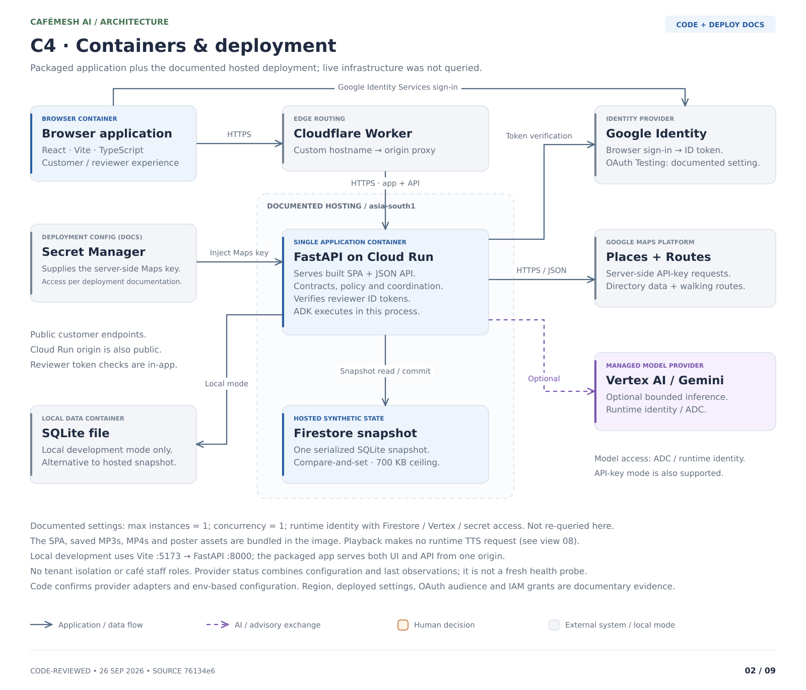
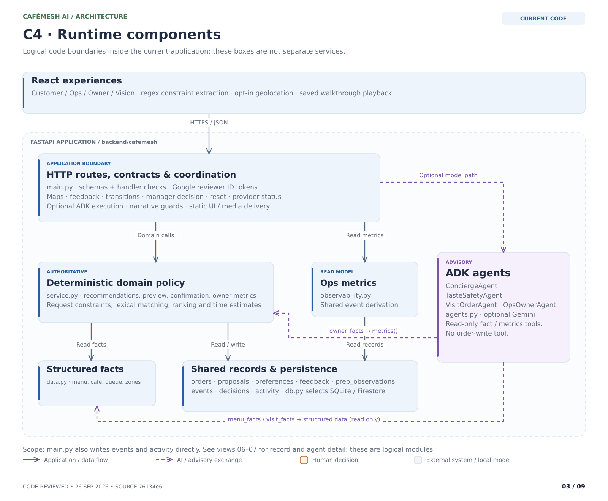
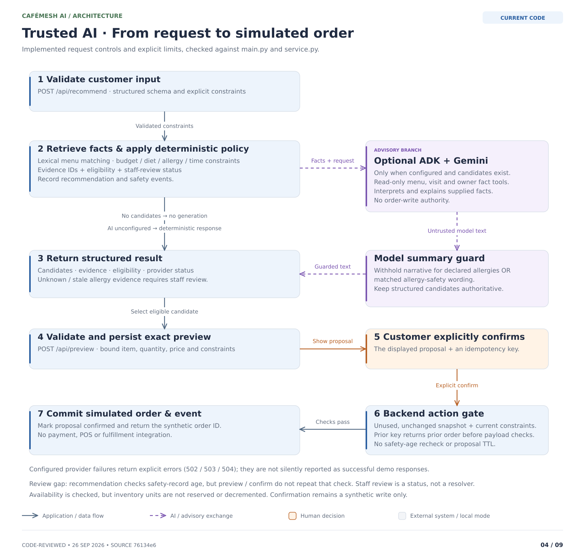
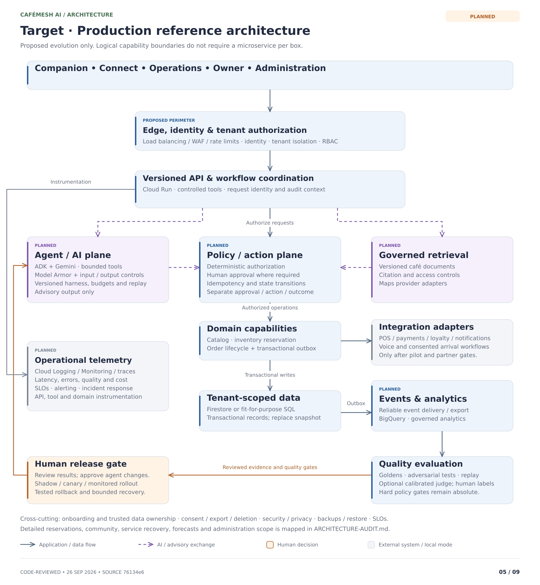
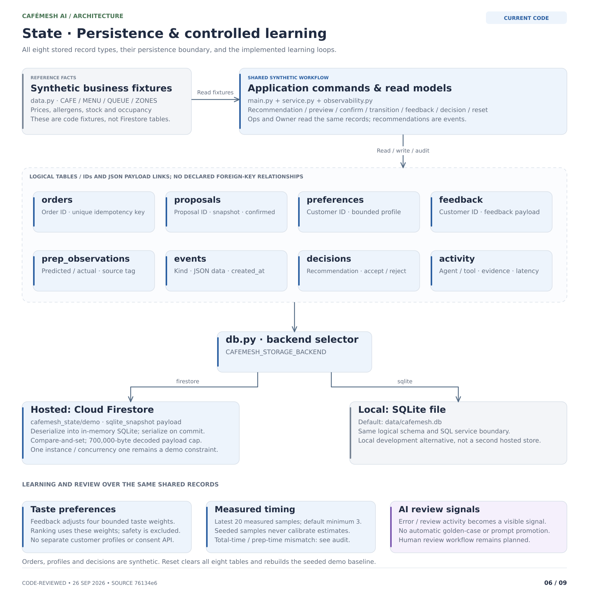
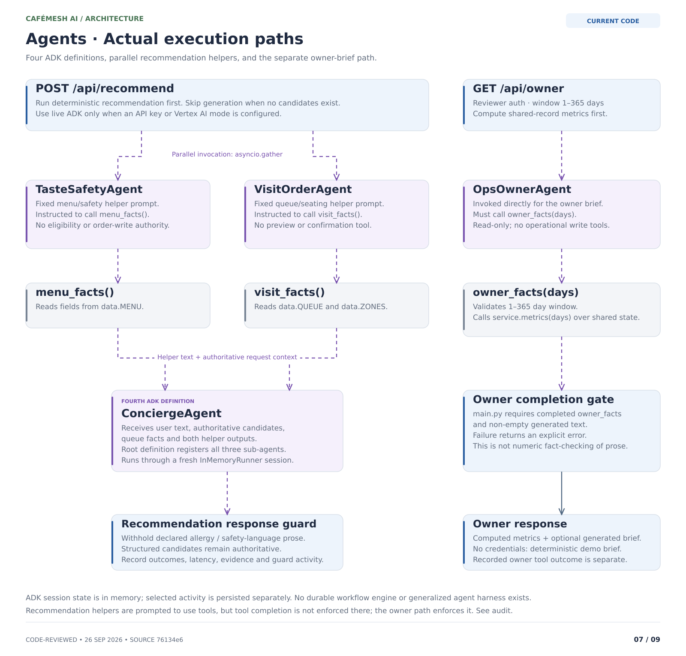
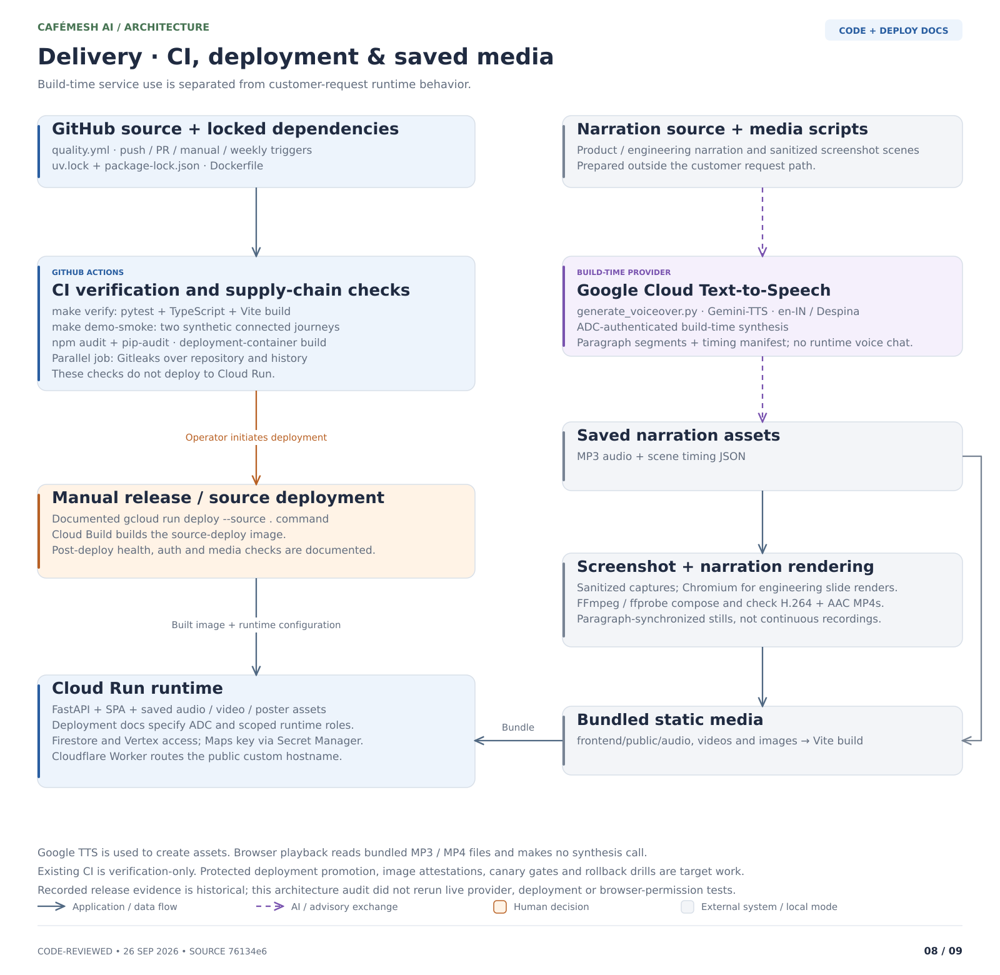
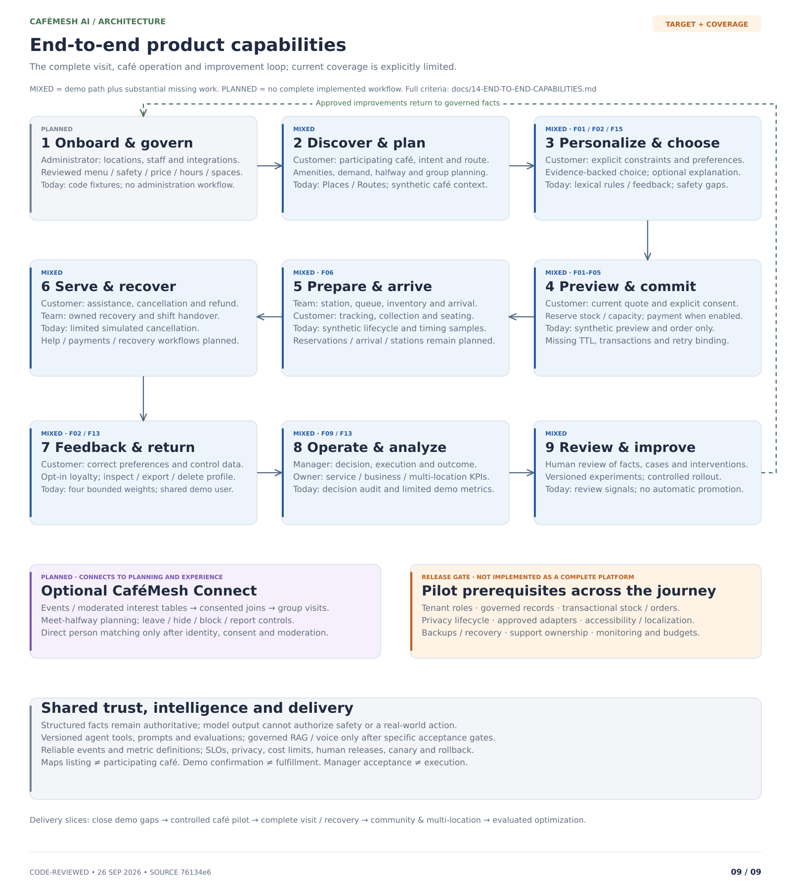

# Architecture

This architecture follows the executable source at [`76134e6`](https://github.com/imrohitagrawal/cafemesh-ai/tree/76134e6099c4abd0c04de06227b91e7944cc0a6e), reviewed on 26 September 2026. Source and configuration establish implemented paths; tests establish only the behavior they exercise. Deployment documentation and planned features are labeled separately. The [code-first audit](architecture/ARCHITECTURE-AUDIT.md) records 15 findings, source evidence, all 16 API routes, and coverage of the architecture views.

The current application is a single-service, synthetic-data demo. Customer, Operations, Owner, and Vision are browser workspaces in one React application; the backend is one FastAPI process. A live Maps listing does not imply café participation or real order fulfillment.

## Diagram index

All nine views are available as SVG, PNG, editable Excalidraw, and Mermaid in the [architecture directory](architecture/README.md). SVG is the primary rendered view. Diagram sources and the code inventory retain the reviewed commit for traceability.

| View | Question answered | Evidence boundary |
| --- | --- | --- |
| 01 — System context | Who uses CaféMesh, and which managed services does it use? | Implemented paths; hosted Firestore dependency explicit |
| 02 — Containers and deployment | Where do UI, API, providers, and persistence run? | Code plus labeled deployment documentation |
| 03 — Runtime components | Which modules own requests, policy, agents, and records? | Implemented module boundaries |
| 04 — Trusted AI and action flow | How do recommendation, explanation, preview, and confirmation interact? | Implemented paths and unresolved gaps |
| 05 — Production reference | What services and controls would a real café product require? | Planned; not deployed |
| 06 — State and learning | What is stored, where, and how does it affect behavior? | Implemented schema and calculations |
| 07 — Agent execution | Which agents and tools run, and what is checked? | Implemented ADK orchestration |
| 08 — Delivery and media | How are code and narrated media built, checked, and delivered? | Code plus labeled manual deployment process |
| 09 — End-to-end product capabilities | What will the complete product let each participant do? | Target journey with current coverage and pilot gates |

## 01 — System context (C4 L1)

Cloud Firestore is an explicit managed dependency with a read/persist relationship. Google Identity issues reviewer tokens, Maps provides Places and walking Routes, and optional Vertex AI/Gemini provides model inference. ADK runs inside the application. Hosting, secrets, CI, and build-time TTS are detailed in views 02 and 08.

## 02 — Containers and deployment (C4 L2)

The Docker build packages the Vite SPA with FastAPI and saved media. A Cloudflare Worker forwards the custom hostname to Cloud Run. Local development uses the Vite server and a SQLite file. Hosted storage selects the Firestore snapshot adapter; these are alternative backends.

Cloud Run region, instance/concurrency limits, runtime IAM, Secret Manager binding, and the OAuth Testing audience are documented deployment settings, not infrastructure re-queried by this review. Google ID-token verification is implemented; there is no application manager/owner role lookup, tenant authorization, or reviewer allowlist. Local reviewer routes may be open when authentication is not configured.

`/api/status` combines configuration and last-observed state. Firestore status comes from backend selection, Maps state is process-local, Gemini status reflects recent Concierge activity, and TTS status checks an asset. It is not a fresh end-to-end provider health probe.

## 03 — Runtime components (C4 L3)

`main.py` owns HTTP routes, schemas and handler checks, token verification, Maps calls, ADK coordination, narrative guards, and static delivery. `service.py` owns deterministic matching, constraints, preview/confirmation, learning, and owner metrics. `agents.py` declares read tools; `data.py` supplies synthetic business fixtures; `db.py` owns persistence; `observability.py` derives the Operations read model.

These are modules in one process, not independent services. Some routes accept dictionaries and use handler checks; not every payload or nested proposal has a complete typed schema. See the audit for the exact public and reviewer-protected route inventory.

## 04 — Trusted AI and action flow

The backend creates structured candidates before optional model explanation. With no candidates, generation is skipped. Configured model failures remain errors; they do not become successful demo responses. Declared allergies or detected allergy-safety wording cause generated recommendation prose to be withheld. The structured result remains authoritative, and agents have no order-write tool.

Preview persists a proposal with item, modifications, quantity, unit price, and supplied constraints. Confirmation checks the saved snapshot and business predicates and writes a simulated order. An existing idempotency key returns its earlier order before comparing the incoming proposal; the browser currently creates a fresh key per attempt. Manager accept/reject records a decision, not execution.

**Unmet requirements:** recommendation checks safety-record age, but preview/confirmation do not repeat that check. Stored safety preferences are not automatically merged into every request, recommendation constraints are not fully bound through preview, proposal age has no TTL gate, and availability checks do not reserve or decrement stock. Recommendation also differs from preview on opening and missing-price handling. These gaps remain recorded as F01–F05 and F15; the diagram does not certify the workflow for real orders.

## 05 — Target production reference

This view is entirely planned. It covers Companion, Connect, Operations, Owner, and Administration; tenant/role authorization; governed catalog and safety records; transactional inventory/orders; reviewed integrations; privacy; telemetry; and a versioned agent/evaluation/release process. The Firestore snapshot must be replaced before concurrent real workloads. A tenant-scoped Firestore or suitable SQL design requires a separate architecture decision.

Future document RAG is for governed SOPs/policies with access, freshness, and citation checks. Structured services retain authority over price, safety, inventory, and actions. Model Armor, BigQuery, calibrated judges, shadow/canary releases, and rollback controls are not connected today. See the [roadmap](roadmap/README.md) and [retrieval decision](12-RETRIEVAL-AND-RAG.md).

## 06 — State, records, and learning

Menu, café, queue, zones, and stock values are fixtures in `data.py`. The eight SQLite tables are `orders`, `proposals`, `preferences`, `feedback`, `prep_observations`, `events`, `decisions`, and `activity`. Recommendation and safety records are event payloads, not additional tables. Relationships use IDs and JSON; there are no declared foreign keys.

The hosted adapter stores one base64-encoded SQLite snapshot in the configurable Firestore document (default `cafemesh_state/demo`, field `sqlite_snapshot`). It deserializes into in-memory SQLite, serializes on commit, enforces a 700,000-byte decoded limit, and uses a transaction with an update-time comparison. It is not a collection-per-entity architecture.

Feedback adjusts four bounded preference weights; safety is excluded from learning. Calibration uses up to 20 measured samples after the configured minimum, excluding seeded samples. The current measurement asks for confirmation-to-ready time but is reused as preparation time with queue added again; displayed estimates and constraint checks also differ. Owner metrics include cancelled rows in their queried population, and repeat visits use a single synthetic customer. See F06/F13 and [learning loops](07-LEARNING-LOOP.md).

## 07 — Agent execution and tools

Recommendation runs fixed-prompt TasteSafety and VisitOrder helpers concurrently, then supplies their text, the user request, candidate facts, and queue context to Concierge. Each runner uses a fresh in-memory session. Concierge registers TasteSafety, VisitOrder, and OpsOwner as sub-agents; the owner endpoint separately invokes OpsOwner with computed metrics.

There are only three custom read tools: `menu_facts()` reads menu fixtures, `visit_facts()` reads queue/zones, and `owner_facts(days)` calls the metrics service. Recommendation helpers are instructed to call tools but do not have the owner's mandatory completed-tool gate. Owner prose requires a completed `owner_facts` call and nonempty text, without a semantic or numeric fact checker. See the [implemented agent contracts](05-AGENT-CONTRACTS.md).

## 08 — Delivery, verification, and media

GitHub Actions installs locked dependencies, runs `make verify` and the connected demo smoke script, audits JavaScript/Python dependencies, builds the Docker image, and scans full Git history for secrets in a separate job. There is no deployment job. Cloud Run source deployment is a documented manual process.

Google Cloud Gemini-TTS generates saved narration during media production. Scripts combine narration/timing and prepared screenshots into MP4 assets; runtime serves and plays the saved files. There is no runtime conversational voice session. Videos are point-in-time assets, not fresh deployment verification.

## 09 — End-to-end product capability coverage

Read the [capability coverage matrix](14-END-TO-END-CAPABILITIES.md) for the full product experience, ownership, current evidence, missing work, and acceptance criteria. This product view complements the technical production reference: it shows how discovery becomes a served visit, how outcomes inform owner decisions, and how approved improvements return to the next visit.

## Review and maintenance

Use the [audit](architecture/ARCHITECTURE-AUDIT.md) for findings and evidence, [developer handoff](architecture/DEVELOPER-HANDOFF.md) for verification/fix tasks, [asset guide](architecture/README.md) for regeneration, and [verification report](11-VERIFICATION-REPORT.md) for historical release results. Documentation corrections do not resolve implementation gaps. Preserve requirements as requirements, add regression tests when fixing defects, and update affected views from the changed source.
