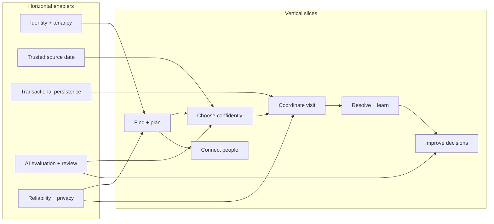

# CaféMesh AI roadmap

For a visual end-to-end product journey, current code coverage, and feature acceptance criteria, see [the capability map](../14-END-TO-END-CAPABILITIES.md). Existing implementation gaps and verification tasks are tracked in the [developer handoff](../architecture/DEVELOPER-HANDOFF.md).

This roadmap converts the product vision into deliverable increments. It is a planning contract, not a statement that future capabilities are already built. Product outcomes are delivered in **vertical slices** (a usable end-to-end capability across UI, API, policy, data, and evaluation); shared foundations are sequenced as **horizontal enablers** only where multiple slices need them.

## Roadmap at a glance

| Horizon | Outcome | Release gate |
| --- | --- | --- |
| H0 · Hackathon demo | A public customer demo plus signed-in synthetic Operations and Owner review, live Maps discovery, grounded constrained recommendations, explicit simulated ordering, feedback, and transparent engineering evidence. | `make verify`, two synthetic journey rehearsals, secret scan, hosted health/auth/video checks. |
| H1 · Single-café pilot | One onboarded café can safely operate real menu, inventory, orders, staff workflows, customer preferences, and support with accountable roles. | Café owner data approval, privacy/security review, transaction/concurrency tests, restore drill, operational alerts and runbooks, AI-quality release gate. |
| H2 · Multi-café platform | Tenant-isolated café network with portable customer discovery, controlled cross-location experiences, richer owner analysis, and reliable integrations. | Tenant isolation and load tests, documented SLOs, event/data governance, partner integration certification, cost and abuse controls. |

## Vertical product slices

Each slice is independently demonstrable and includes observability and acceptance evidence. “Foundation” rows further below are prerequisites, not user-visible product claims.

| Slice | Customer value | Café-team value | Owner value | Main dependencies |
| --- | --- | --- | --- | --- |
| A. Find and plan | Nearby café discovery, current or typed origin, open status, route estimate, amenities and visit timing with provenance. | Clear boundary between directory result and participating café. | Discovery funnel and availability signals when consented analytics exist. | Places/Routes; café onboarding and verified profile for pilot. |
| B. Choose confidently | Structured menu search, preferences, explicit constraints, cited facts, safe no-match and staff-review outcomes. | Curated ingredient/allergen/cross-contact evidence and escalation queue. | Menu demand and substitution signals from recorded actions. | Versioned menu/safety records; golden cases; role-based editing. |
| C. Coordinate a visit | Order preview, clear total, confirmed state, prep estimate, arrival guidance and seating information. | Shared queue, station workload, readiness, occupancy and service requests. | Wait, conversion, cancellations and capacity metrics from shared events. | Transactions, inventory reservations, state model, notification consent. |
| D. Resolve and learn | Feedback, service recovery, visible preference controls and improved return visit. | Assign issue, document action, confirm resolution, hand over unresolved work. | Satisfaction and recovery reporting with definitions and windows. | Customer export/deletion, support workflow, outcome events. |
| E. Connect people | Opt-in interest tables/events, group needs and meet-halfway suggestions. | Manage hosted events and capacity; moderate reported issues. | Event utilization and group demand. | Consent, identity controls, moderation, accessibility and abuse response. |
| F. Improve decisions | Useful quiet-time, menu, and visit suggestions with uncertainty shown. | Reviewed demand/stock/staff suggestions and intervention outcomes. | Daily brief, menu contribution, multi-location comparison only where data supports it. | Reliable event stream, data-quality contract, reviewed evaluation and experiments. |
| G. Trustworthy agent harness | A traceable workflow that validates agent/tool behavior, detects drift, supports replay, and proposes safe workflow improvements. | Managers see why an agent escalated, failed, or proposed an action and can review evidence. | Owners can inspect quality, cost, latency, failure, and intervention outcomes by version. | Versioned agent harness, privacy-aware traces, representative evals, human review, canary/rollback controls. |

## Horizontal platform enablers

| Enabler | Required capability | Gate |
| --- | --- | --- |
| Identity and tenancy | Customer identity/consent; café, location and staff roles; tenant-scoped authorization and audit. | Negative cross-tenant access tests pass before real café data. |
| Data trust | Owner-approved menu, ingredient, allergen and cross-contact sources; freshness, version, correction, and deletion workflows. | Missing or stale critical evidence fails closed and routes to staff. |
| Transactional operations | Normalized persistent entities, idempotent commands, stock reservation, outbox/event handling, retries, recovery. | Concurrency and duplicate/replay tests; restore/reconcile drill. |
| AI governance | Versioned prompts/models/tools; reviewed goldens; deterministic hard gates; calibrated optional LLM judge; rollback. | Safety gates cannot be averaged away by model scores; humans adjudicate critical cases. |
| Agent harness and observability | End-to-end workflow traces, tool inputs/outputs with sensitive-field minimization, replay fixtures, policy-decision evidence, per-agent cost/latency/error/quality metrics, drift alerts. | Trace completeness, redaction, access controls, bounded retention, and alert/runbook checks pass before production traces are retained. |
| Reliability and security | Rate/cost limits, request IDs, timeouts, bounded retries, WAF/abuse controls, alerting, response runbooks. | Load, fault-injection, authz, privacy and incident exercises. |
| Analytics | Canonical event definitions, retention/consent rules, data quality and window/formula contracts. | Reconcile owner metrics to source records before dashboards are used for decisions. |
| Accessibility and localization | WCAG testing, keyboard/screen-reader paths, supported locales, translated safety terms. | Human language review for allergy and order confirmation wording. |
| Delivery and supply chain | Protected CI, code review, reproducible builds, dependency/security checks, image provenance, staged deploy, rollback. | Build/test the exact commit and verify hosted smoke checks before promotion. |

## Horizontal and vertical sequencing

## Where each AI and platform practice applies

| Practice | Appropriate use in CaféMesh | Avoid / hard boundary | Status |
| --- | --- | --- | --- |
| Generative AI + ADK agents | Interpret flexible customer intent, coordinate bounded read tools, and draft owner explanations from retrieved metrics. | The model does not decide allergy eligibility, invent missing facts, write an order, reassign staff, or override manager approval. | Four ADK role definitions and an optional live Gemini path exist; backend policy owns effects. |
| Structured retrieval | Search versioned menu, ingredients, allergens, price, stock, hours, queue, and occupancy records with typed fields and source IDs. | Do not embed volatile authoritative values and treat similarity as truth. | Current small lexical retrieval plus deterministic filters. |
| RAG | Retrieve café SOPs, service policies, accessibility guidance, and other long-form approved documents with tenant access filters, citations, freshness, and refusal thresholds. | Not the source for price, current stock, allergen, cross-contact, open status, or queue. | Future; no RAG service is implemented. Evaluation set must cover retrieval/citation and answer grounding. |
| Golden evaluations | Version concrete requests and expected structured outcomes: allergy escalation, budget/temperature/diet fit, espresso retrieval, no-match, stale evidence, tool errors, permission, and order invariants. | A passing tiny golden set is not general safety proof; avoid training and scoring on the same held-out examples. | Current policy tests plus three retrieval smoke goldens; broaden and review before pilot. |
| LLM-as-a-judge | Offline secondary scoring for groundedness, completeness, citation quality, and response usefulness after calibration against blind human labels. | Never a sole release gate or authority for allergies, authorization, or real-world action; publish judge agreement and disagreement. | Not implemented; calibration and human adjudication are roadmap gates. |
| Agent harness | Version workflow graph, tools, prompts, model/config, permissions, traces, deterministic replay, fault injection, eval suites, budget limits, and canary/rollback evidence. | Do not hide tool side effects, leak sensitive traces, or allow unconstrained delegation. | Initial ADK coordination and event activity exist; generalized harness and replay are future. |
| Observability | Correlate request → agent → tool → policy → approval → write → outcome; measure quality, latency, errors, cost, provider state, and recovery. | Demo event counts are not SLOs; do not infer causal improvement from correlation. | Persisted demo activity/Ops dashboard exists; distributed traces, Cloud Monitoring alerts and SLOs are future. |
| Self-learning | Learn visible, reversible taste weights and calibrate prep estimates from measured—not seeded—outcomes. | Never infer, weaken, or learn allergies/religious/safety restrictions; no automatic prompt or permission edits. | Bounded customer preference and prep loops exist; richer learning dashboards are future. |
| Self-healing / autonomous recovery | Detect failures, stop unsafe branches, bounded-retry idempotent reads, trip provider circuits, preserve requests for review, route to staff, and recommend rollback. | Never automatically alter access, safety policy, production prompts/tools, stock, staffing, or orders; human approval for consequential execution. | Provider errors are surfaced; general repair/recovery harness is future. |
| Voice | Static TTS narration for product/engineering walkthroughs; later opt-in multilingual voice interaction with confirmation and accessibility controls. | Narration audio is not live voice chat, identity proof, order consent, or safety evidence. | Saved Google TTS assets exist; interactive Gemini Live voice is future. |
| Google Cloud | Cloud Run hosts the public synthetic demo; Firestore stores a bounded single-document demo snapshot; Vertex AI, Maps, and sign-in are provider paths. | Current persistence/auth are not multi-tenant production foundations; a configured integration does not equal a recently successful request. | Hosted and partly live, with precise status documented in verification evidence. |

This map keeps techniques attached to a concrete workflow and data type. A technology belongs in a slice only when it has a clear owner, failure mode, evaluation, provenance contract, and release gate.

## Scale plan and architecture triggers

The demo deliberately runs one Cloud Run instance with concurrency one while using one compare-and-set Firestore snapshot. This is a constraint, not a scaling strategy. Do not raise concurrency or instance count on that storage design.

| Trigger | Response before increasing load |
| --- | --- |
| More than one process/instance or concurrent real café operations | Replace snapshot with tenant-keyed transactional entities; enforce stock reservation and idempotency under concurrency. |
| More cafés, regions, or regulatory boundaries | Define tenant isolation, region/data residency policy, per-tenant encryption/access/audit, and tested backup/restore. |
| Provider latency, quota, or failure affects journeys | Add explicit per-provider bulkheads, shared request budgets, bounded retry rules, circuit signals, and user-visible degradation behavior. |
| Public traffic or AI cost becomes material | Add edge/API rate limits, abuse detection, per-user and global model budgets, quotas, and cost alerts. |
| More workflows need async work | Add durable queue/outbox only for identified long-running/retryable workloads; keep synchronous user decisions bounded and idempotent. |
| Owner decisions depend on history across sites | Define canonical event contracts and quality checks before exporting to BigQuery; retain source lineage and metric definitions. |
| More agents/tools increase complexity | Keep explicit contracts, least privilege, isolated evaluation, per-tool traces, bounded delegation, and human approval for impact. |
| Repeated agent/tool failures or quality drift | Automatically detect, correlate, and group failures; retry only within bounded idempotent policy; route to a safe degraded path or human review; draft a fix/eval candidate. Do not autonomously change production prompts, permissions, safety policy, or tool authority. |
| A proposed agent/workflow improvement is ready | Replay against versioned golden, adversarial, and regression suites; compare latency/cost/grounding/safety; use shadow or bounded canary; require named human release approval and rollback plan. |

We do not add microservices, a vector database, or forecasting models until a measured product or scaling need justifies their operating cost. See [13 — Engineering practices](../13-ENGINEERING-PRACTICES.md), [04 — Architecture](../04-ARCHITECTURE.md), and [12 — Retrieval and RAG](../12-RETRIEVAL-AND-RAG.md).

## Agentic AI, self-improvement, and operational recovery

The roadmap uses “self-learning” and “self-healing” carefully. The system may learn bounded customer taste preferences and calibrate estimates from measured outcomes. It may automatically detect service failures, stop unsafe tool paths, retry safe idempotent reads, open review candidates, and recommend a rollback or operator action. These are supervised operational controls.

It must not automatically learn or weaken allergies, dietary restrictions, access permissions, tenant boundaries, business invariants, or manager approval. It must not rewrite deployed prompts, tools, policies, datasets, or model routing and then release itself. A future agent harness should provide:

- A versioned workflow graph, tool schemas, permissions, prompt/model/config IDs, and bounded delegation/step/time/token/cost budgets.
- Correlated traces from user intent through retrieval, policy checks, agent/tool calls, approval, write, and outcome; redact sensitive data and apply retention controls.
- Deterministic replay and fault injection for provider timeouts, malformed tool output, stale facts, retries, duplicate requests, and partial failure.
- Separate task success, grounding/citation, policy compliance, refusal correctness, tool selection, latency, cost, and human outcome metrics.
- Golden datasets plus adversarial and regression cases, with reviewer provenance and held-out sets to limit overfitting.
- LLM-as-a-judge only as a calibrated measurement aid against human labels, reporting agreement, disagreement, bias, and judge/model versions. Deterministic policy gates remain absolute.
- Safe recovery policies (bounded retries, circuit breaking, compensation, no-answer, staff escalation) and staged shadow/canary rollout with a tested rollback.
- Human-governed candidate promotion: detected issue → reviewed case → proposed change → offline regression → independent approval → bounded rollout → monitored outcome.

Current implementation is narrower: persisted synthetic activity, errors, tool latency, deterministic tests, three retrieval goldens, and human review candidates. It does not have full distributed tracing, a generalized agent harness, judge calibration, autonomous repair, or automatic agent improvement. The engineering walkthrough should explain both the implemented baseline and the governed target state without suggesting those future controls are live.
